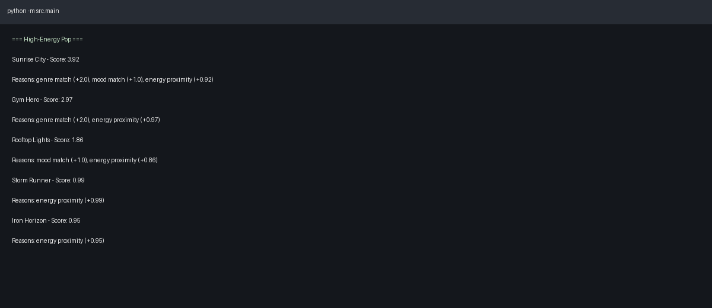
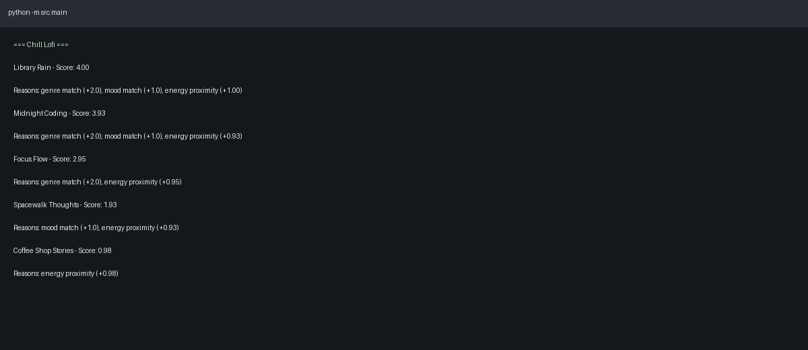
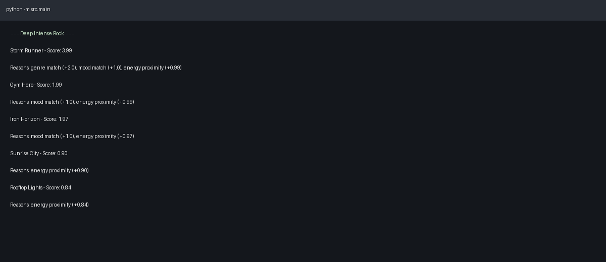

# 🎵 Music Recommender Simulation

## Project Summary

This project is a content-based music recommender built in Python. It reads a small song catalog from CSV, compares each song to a user taste profile, assigns a score, and returns the top-ranked songs with transparent reason strings.

The project includes both a functional layer (used by `src/main.py`) and an OOP layer (used by `tests/test_recommender.py`) so the same recommendation idea is demonstrated in two common programming styles.

---

## How The System Works

Each song has structured attributes like genre, mood, and energy. A user profile also contains preferred genre, preferred mood, and target energy. The recommender computes a score for every song and sorts songs from highest score to lowest score.

### Features Used

- Song features: `genre`, `mood`, `energy` (plus extra metadata in the catalog)
- User profile: preferred `genre`, preferred `mood`, target `energy`

### Algorithm Recipe

For each song:

1. Start with score `0.0`
2. If genre matches the user genre, add `+2.0`
3. If mood matches the user mood, add `+1.0`
4. Add energy proximity:
   - `round(1.0 - abs(song_energy - user_energy), 2)`
5. Save reasons for points earned
6. Sort all songs by score descending and return top `k`

The OOP `Recommender` version uses the same core logic and adds `+0.5` when `likes_acoustic=True` and song acousticness is above `0.6`.

---

## Getting Started

### Setup

1. Create a virtual environment (optional but recommended):

```bash
python -m venv .venv
source .venv/bin/activate      # Mac or Linux
.venv\Scripts\activate         # Windows
```

2. Install dependencies:

```bash
pip install -r requirements.txt
```

3. Run the app:

```bash
python -m src.main
```

### Running Tests

```bash
python -m pytest
```

---

## Evaluation Profiles and Outputs

The system was run with three required profiles:

- High-Energy Pop (`genre=pop`, `mood=happy`, `energy=0.9`)
- Chill Lofi (`genre=lofi`, `mood=chill`, `energy=0.35`)
- Deep Intense Rock (`genre=rock`, `mood=intense`, `energy=0.92`)

### Screenshot Placeholders

Add your terminal screenshots to `assets/` and keep these links:

- 
- 
- 

---

## Experiments You Tried

### Experiment: Reduce genre weight from `+2.0` to `+0.5`

I ran a side-by-side comparison in a temporary script (without changing the final recommender code) to see how much genre dominance affects rankings.

- **Baseline (`genre=+2.0`)** strongly prioritizes exact genre matches in top positions.
- **Reduced genre (`genre=+0.5`)** allows close energy and mood matches from other genres to move up.
- For the **High-Energy Pop** profile, pop tracks still rank well, but non-pop songs with close energy values become more competitive.

This experiment shows that weight choices directly control whether the model behaves as strict taste matching or broader vibe matching.

Observed top-3 for High-Energy Pop:

- Baseline (`genre=+2.0`): `Sunrise City`, `Gym Hero`, `Rooftop Lights`
- Reduced genre (`genre=+0.5`): `Sunrise City`, `Rooftop Lights`, `Gym Hero`

---

## Limitations and Risks

- The catalog is very small (15 songs), so recommendation quality is constrained by limited coverage.
- The model uses only a few hand-picked attributes and ignores lyrics, era, language, and context.
- A fixed rule-based score can overfit to one preference dimension (especially genre weight).
- The dataset may reflect a narrow taste distribution, which can systematically under-serve users with niche preferences.
- Explanations are transparent but simple; they do not capture nuanced musical reasons.

More detail is included in [`model_card.md`](model_card.md).

---

## Reflection

Building this recommender made it clear how much a recommendation system depends on feature choices and weighting decisions, not just code correctness. Even a tiny scoring formula can produce very different listening experiences depending on how strongly genre, mood, or energy is weighted. The explainable reason strings were useful because they made ranking behavior easy to audit profile by profile.

This project also highlighted fairness and bias concerns in recommender design. With a small curated catalog, it is easy to unintentionally favor certain genres or emotional tones while marginalizing others. Real-world systems are larger and more complex, but the same core challenge remains: recommendation quality is never just about accuracy; it is also about representation, transparency, and user trust.

---

## Model Card

See the completed model card here: [**Model Card**](model_card.md)
