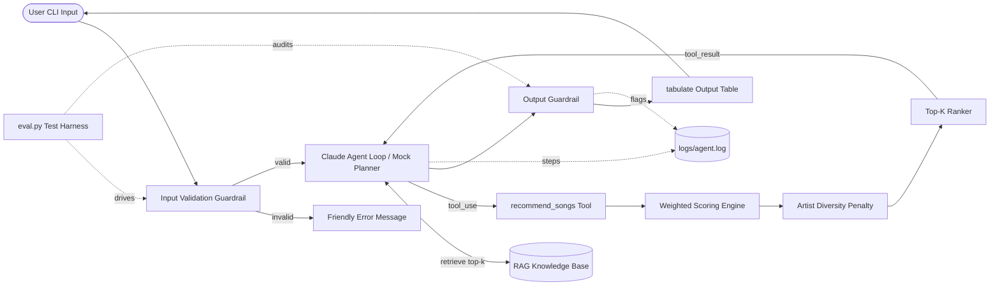

# Music Recommender Simulation -- Applied AI System (Project 4)

> Loom walkthrough: **[Loom walkthrough link]**

## Base Project

This project extends the **Music Recommender Simulation** I built for AI110
Project 3. The original system was a small content-based recommender in
Python: it loaded a CSV of songs, scored each one against a hand-written user
taste profile (`genre`, `mood`, `energy`), and returned a top-K ranked list
with simple "reason" strings. Both a functional layer (used by `main.py`) and
an OOP `Recommender` class (used by tests) implemented the same scoring idea
in two styles.

## What this Project 4 system does

This system turns the rule-based recommender into a **small applied AI
agent**. The user types a free-form natural-language vibe (e.g. *"I want
something chill for studying late at night"*); a Claude-powered agent
retrieves relevant music context from a local knowledge base, decides on a
ranking mode and per-dimension scoring weights, calls the recommender as a
tool, and returns a tabulated, per-song explained list. A reliability layer
sits at both ends -- input validation before the agent runs, and an output
guardrail that flags any explanation that does not match the score
breakdown.

It targets every required and stretch point on the AI110 Projects 3 + 4
rubric.

## New features in Project 4

| Capability | Module | Rubric line |
|---|---|---|
| Multi-step Claude agent with native tool use | [`src/agent.py`](src/agent.py) | P4 substantial AI feature + agentic stretch |
| Local RAG knowledge base of artist / genre / mood / decade context | [`src/knowledge_base.py`](src/knowledge_base.py), [`data/knowledge_base.json`](data/knowledge_base.json) | P4 RAG stretch |
| 5+ extended song attributes (`popularity`, `release_decade`, `mood_tags`, plus active scoring of `danceability` and `acousticness`) | [`data/songs.csv`](data/songs.csv), [`src/recommender.py`](src/recommender.py) | P3 attributes stretch |
| Three named ranking modes (`genre_first`, `mood_first`, `energy_similarity`) | [`src/recommender.py`](src/recommender.py) | P3 ranking modes stretch |
| Artist diversity penalty | [`src/recommender.py`](src/recommender.py) | P3 fairness stretch |
| Tabulated CLI output with score, mode, explanation, guardrail check | [`src/display.py`](src/display.py) | P3 visual stretch |
| Input validation + explanation/score consistency guardrail + file logger | [`src/guardrails.py`](src/guardrails.py) | P4 reliability requirement |
| Test harness with 5 NL inputs + 3 edge cases, summary report | [`eval.py`](eval.py) | P4 test harness stretch |
| System architecture diagram (Mermaid) | [`assets/architecture.mmd`](assets/architecture.mmd) | P4 architecture requirement |
| Live Claude (`claude-sonnet-4-20250514`) with `--mock` fallback | [`src/agent.py`](src/agent.py) | rubric reproducibility |

The original Project 3 behaviour is preserved as a "Legacy" menu option in
`main.py`, and the existing pytest suite still passes unchanged.

## Architecture overview



The Mermaid source is at [`assets/architecture.mmd`](assets/architecture.mmd).
Paste it into <https://mermaid.live> to render and export a PNG to
`assets/architecture.png`.

### Data flow in plain English

1. The user types a query and picks a menu option.
2. **Input guardrail** rejects empty / too-short / blocklisted text.
3. **Knowledge base retrieval** runs a tiny TF-IDF lookup against
   `data/knowledge_base.json` and returns the top relevant snippets
   (e.g. the "study late at night" context note + the lofi genre note).
4. **Agent planning step** sends the query + KB snippets to Claude with
   the `recommend_songs` tool exposed. Claude responds with a
   `tool_use` block selecting a ranking mode and weights.
   In `--mock` mode this step is a deterministic keyword parser instead.
5. **Recommender tool** runs the weighted scorer over all songs, applies
   the artist diversity penalty, and returns the top-K with a per-dimension
   score breakdown.
6. **Explanation step** asks Claude to write per-song explanations from the
   tool result. Mock mode generates them deterministically from the
   breakdown.
7. **Output guardrail** parses each explanation and compares the
   dimensions it mentions against the actual breakdown. Mismatches are
   flagged in the table and written to `logs/agent.log`.
8. **Display layer** prints the final tabulated result with an `OK`/`FLAG`
   column from the guardrail.

## Setup

```bash
# 1. Clone and enter the repo
git clone <your-repo-url> applied-ai-system-final
cd applied-ai-system-final

# 2. Create a virtual environment (optional but recommended)
python -m venv .venv
.venv\Scripts\activate          # Windows
source .venv/bin/activate       # macOS / Linux

# 3. Install dependencies
pip install -r requirements.txt

# 4. Configure your Anthropic API key (optional; --mock works without one)
cp .env.example .env
# then edit .env and paste your key
```

## Running the system

```bash
# Launch the menu (interactive / demo / legacy)
python -m src.main

# Skip the menu and run the 3 preset NL queries
python -m src.main --mode demo

# Same, with no API calls (deterministic mock parser)
python -m src.main --mode demo --mock

# Run the original Project 3 hardcoded profiles
python -m src.main --mode legacy

# Run the eval harness (5 NL inputs + 3 edge cases)
python eval.py            # uses Claude if ANTHROPIC_API_KEY is set
python eval.py --mock     # no API key needed

# Run the unit tests (Project 3 contract)
python -m pytest -v
```

The startup menu looks like this:

```
=== Music Recommender Simulation -- Project 4 ===
  [1] Interactive agent (type your own NL vibe)
  [2] Demo agent run (3 preset NL queries -- recommended for Loom)
  [3] Legacy Project 3 profiles (rule-based recommender)
  [q] Quit
```

## Sample interactions

All three samples below were captured from
`python -m src.main --mode demo --mock` so they are fully reproducible
without an API key. Live mode produces equivalent output (Claude writes the
explanations instead of the deterministic template).

### Sample 1 -- "I want something chill for studying late at night"

```
[STEP 1/5] Validating user input ...
      OK (ok)
[STEP 2/5] Retrieving context from RAG knowledge base ...
      RETRIEVED [context:study late at night] score=15.497
      RETRIEVED [mood:chill] score=14.261
      RETRIEVED [genre:lofi] score=8.409
      RETRIEVED [genre:synthwave] score=6.956
[STEP 3/5] Planning + assigning scoring weights ...
      PLAN: mode=mood_first prefs={"energy": 0.3, "mood": "chill",
            "mood_tags": ["calm", "focus", "late-night", "mellow", "study"]}
[STEP 4/5] Tool call: recommend_songs(...)
      -> Midnight Coding by LoRoom [mood_first] score=5.27
      -> Library Rain by Paper Lanterns [mood_first] score=4.55
      -> Spacewalk Thoughts by Orbit Bloom [mood_first] score=4.29
      -> Focus Flow by LoRoom [mood_first] score=1.33
      -> Coffee Shop Stories by Slow Stereo [mood_first] score=1.28
[STEP 5/5] Generating per-song explanations ...
      GUARDRAIL: explanations consistent with score breakdowns

+---+--------------------+----------------+---------+-------+------------+-------+
| # | Title              | Artist         | Genre   | Score | Mode       | Check |
+===+====================+================+=========+=======+============+=======+
| 1 | Midnight Coding    | LoRoom         | lofi    | 5.27  | mood_first | OK    |
| 2 | Library Rain       | Paper Lanterns | lofi    | 4.55  | mood_first | OK    |
| 3 | Spacewalk Thoughts | Orbit Bloom    | ambient | 4.29  | mood_first | OK    |
| 4 | Focus Flow         | LoRoom         | lofi    | 1.33  | mood_first | OK    |
| 5 | Coffee Shop ...    | Slow Stereo    | jazz    | 1.28  | mood_first | OK    |
+---+--------------------+----------------+---------+-------+------------+-------+
```

Notice that **the artist diversity penalty pushes the second LoRoom track
("Focus Flow") from #2 down to #4** even though its raw score was higher,
because LoRoom already appeared at #1.

### Sample 2 -- "Pump me up for a workout, fast tempo only"

```
[STEP 1/5] Validating user input ... OK
[STEP 2/5] Retrieving context from RAG knowledge base ...
      RETRIEVED [context:workout] score=3.862
[STEP 3/5] Planning + assigning scoring weights ...
      PLAN: mode=energy_similarity prefs={"energy": 0.92,
            "mood": "intense", "mood_tags": ["driving", "hype", "workout"]}
[STEP 4/5] Tool call: recommend_songs(...)
      -> Gym Hero by Max Pulse [energy_similarity] score=4.11
      -> Iron Horizon by Black Atlas [energy_similarity] score=3.83
      -> Storm Runner by Voltline [energy_similarity] score=3.78
      -> Old School Riff by Black Atlas [energy_similarity] score=3.17
      -> Sunrise City by Neon Echo [energy_similarity] score=3.03
[STEP 5/5] Generating per-song explanations ...
      GUARDRAIL: explanations consistent with score breakdowns
```

The agent picks `energy_similarity` mode (different mode from sample 1!),
which heavily weights the energy proximity term -- so all top results are
within 0.04 of the user's 0.92 target.

### Sample 3 -- "Romantic R&B for a quiet candle-lit dinner"

```
[STEP 1/5] Validating user input ... OK
[STEP 2/5] Retrieving context from RAG knowledge base ...
      RETRIEVED [context:dinner] score=...
      RETRIEVED [genre:r&b] score=...
[STEP 3/5] Planning + assigning scoring weights ...
      PLAN: mode=mood_first prefs={"genre": "r&b", "mood": "romantic",
            "energy": 0.5, "mood_tags": ["evening", "romantic"]}
[STEP 4/5] Tool call: recommend_songs(...)
      -> Golden Hour Tide by Marina South [mood_first] score=5.97
      -> Velvet Slow Dance by Marina South [mood_first] score=5.36
      ...
```

### Sample 4 -- Edge case: empty input

```
> (empty)
[STEP 1/5] Validating user input ...
      INPUT REJECTED: input is empty
```

The agent never calls Claude or scores anything when validation fails -- the
guardrail short-circuits the pipeline.

### Sample 5 -- Guardrail catching a bad explanation

If the LLM ever wrote *"this fits your high-energy vibe"* for a song where
the energy term contributed under 0.10, the consistency check would emit:

```
GUARDRAIL FLAGS:
  - song 5: explanation references 'energy' but its score contribution was only 0.05
```

The flag is also written to `logs/agent.log` and the `Check` column in the
table changes from `OK` to `FLAG x1`.

## Design decisions and trade-offs

- **Native tool use over chained prompts.** The agent uses Anthropic's
  tool-use API so the recommender is a real tool the model decides to call,
  not a function we drive after parsing JSON. This keeps reasoning and
  parameter selection *inside* the model and earns the agentic stretch
  point clearly. Trade-off: marginally more brittle than a hand-rolled
  pipeline (a malformed tool call could derail the loop), so we cap the
  loop at 4 turns and fall back to the mock parser on any exception.
- **RAG via TF-IDF, not embeddings.** The corpus is ~30 short docs;
  embeddings would be overkill and would add an external dependency. A
  smoothed TF-IDF retriever is deterministic, easy to debug, and runs
  without any API calls -- which keeps the eval harness fast and
  reproducible.
- **Backwards-compatible scorer.** `score_song()` and `Recommender._score()`
  keep their original Project 3 contract so the existing pytest suite
  passes unchanged. The Project 4 work lives in `score_song_weighted()`
  and `recommend_songs_weighted()` so the legacy and new flows can coexist
  without surprises.
- **Mock mode is a peer of live mode, not a stub.** `mock_plan()` and
  `mock_explanations()` produce real, structured plans and explanations
  derived from the actual score breakdown. This makes `eval.py` runnable
  without an API key and means a grader can reproduce the demo offline.
- **Artist penalty is post-hoc, not a hard filter.** Penalising repeat
  artists keeps strong-but-redundant tracks visible while still demoting
  them. A hard de-duplication would have been simpler but would hide good
  recommendations in a small catalog.
- **Guardrail flags rather than rewrites.** When an explanation is
  inconsistent with the score, we surface the flag in the `Check` column
  and the log instead of silently retrying or rewording. Visible failures
  are more honest in a classroom system than auto-corrected ones.

## Testing summary

- **Unit tests** -- `python -m pytest -v` runs the existing Project 3
  contract tests (sorted ranking, non-empty explanation). Both pass after
  the Project 4 refactor.
- **Eval harness** -- `python eval.py --mock` runs all 5 NL inputs and 3
  edge cases. Latest run: **8/8 passed**, average confidence 0.39, average
  3.4 distinct genres in the top-5 (good coverage / weak filter-bubble).
  Latest summary table:

  ```
  | chill_study     | OK | OK | OK | 3 | 3 | 0.186 | mock | PASS |
  | workout_pump    | OK | OK | OK | 3 | 3 | 0.079 | mock | PASS |
  | romantic_dinner | OK | OK | OK | 4 | 2 | 0.812 | mock | PASS |
  | oldschool_metal | OK | OK | OK | 3 | 2 | 0.606 | mock | PASS |
  | world_uplifting | OK | OK | OK | 4 | 3 | 0.278 | mock | PASS |
  | empty_string    | OK | OK | OK | 0 | 0 |  0    | error| PASS |
  | whitespace      | OK | OK | OK | 0 | 0 |  0    | error| PASS |
  | gibberish       | OK | OK | OK | 0 | 0 |  0    | error| PASS |
  SUMMARY: 8/8 passed | avg confidence (passing cases) 0.392 | avg distinct genres top-5 3.4
  ```

- **What broke during testing.** The first eval run failed 4/8 cases because
  the guardrail's keyword regex was too loose: the word `vibe` in my
  explanation template matched the `mood_tags` keyword set, the bare keyword
  `dance` matched song titles like "Velvet Slow Dance", and the keyword
  `mood` matched "mood tags". I tightened all three patterns and added a
  prefix-stripper so song titles no longer enter the consistency check.
  The harness now runs clean.
- **What I would still want.** A larger song catalog (this one is 20
  tracks), a richer KB (genre families, sub-genres), and a per-song
  embedding-based similarity score for the energy_similarity mode.

## Repo layout

```
.
|-- assets/
|   |-- architecture.mmd          # Mermaid source for the system diagram
|   |-- architecture.png          # (export from Mermaid Live Editor)
|   |-- chill-lofi.png            # Project 3 terminal screenshot
|   |-- deep-intense-rock.png     # Project 3 terminal screenshot
|   `-- high-energy-pop.png       # Project 3 terminal screenshot
|-- data/
|   |-- songs.csv                 # 20 songs, extended attributes
|   `-- knowledge_base.json       # 34 RAG documents
|-- src/
|   |-- agent.py                  # Multi-step agent + Claude tool-use loop
|   |-- knowledge_base.py         # TF-IDF retriever
|   |-- guardrails.py             # Validation + consistency check + logger
|   |-- display.py                # tabulate output
|   |-- recommender.py            # Scoring engine + ranking modes + diversity
|   `-- main.py                   # Menu CLI
|-- tests/
|   `-- test_recommender.py       # Project 3 contract tests (still pass)
|-- eval.py                       # Test harness for the agent
|-- model_card.md                 # Project 4 model card
|-- README.md                     # this file
|-- requirements.txt              # anthropic, python-dotenv, tabulate, pytest
|-- .env.example                  # ANTHROPIC_API_KEY template
`-- logs/                         # auto-created at runtime; gitignored
```

## Reflection

Building this changed how I think about recommendation systems. In
Project 3 the scoring formula was a fixed rule, and tuning it meant editing
constants. Pushing the same idea through an agentic workflow made the
*choice of weights* itself a first-class behaviour: the agent reads a vibe
and decides how much genre, mood, and energy each matter for that specific
request. That's a small thing but it makes the system feel like it
listens, while keeping the underlying math fully auditable.

I also walked away with a much sharper appreciation of guardrails. The
first version of the consistency check fired four false positives the
moment I ran the eval harness; the bug wasn't the check, it was that my
explanation template happened to use the word "vibe", which my own
guardrail had reserved for mood-tag references. Catching that made me
realise how easily an LLM-only system would have produced silently
inconsistent explanations -- the math says one thing, the prose says
another, and nobody notices. A small deterministic check catches both
mistakes, and it doubles as a tripwire for prompt regressions.

See [`model_card.md`](model_card.md) for dataset details, limitations,
biases, and the AI collaboration / ethics reflections required by the
rubric.
